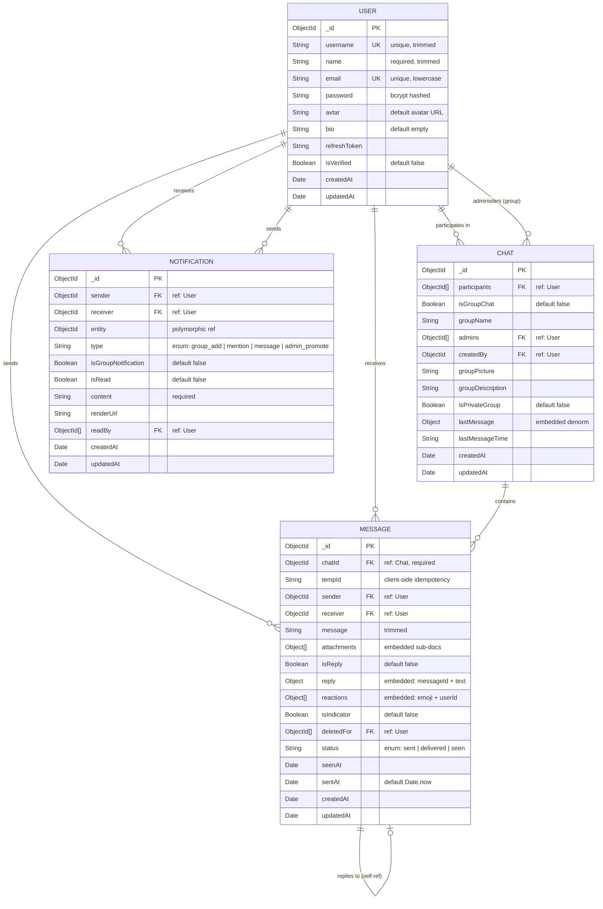
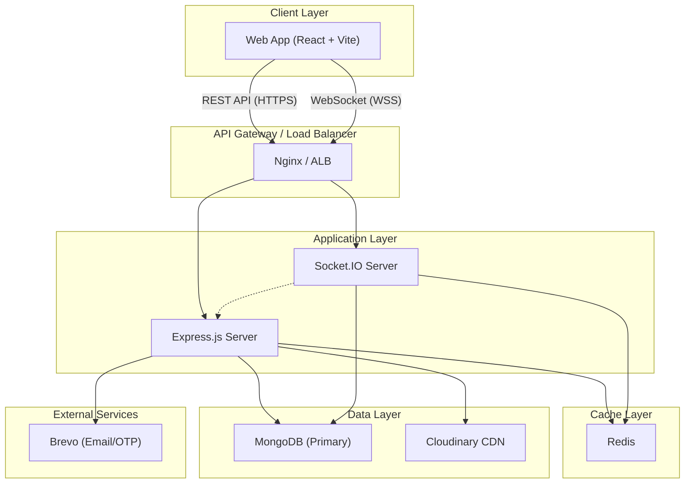
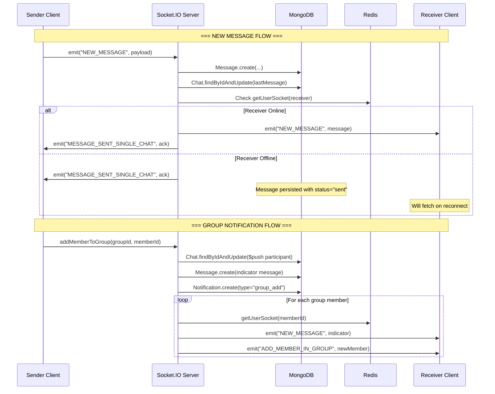
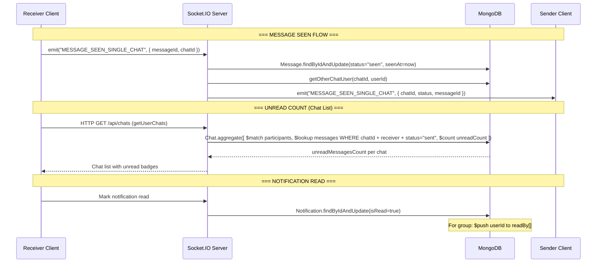

# Chat Application — System Design Document

> **FAANG-Grade System Design Artifacts** for a real-time chat application built on MongoDB, Express, Socket.IO, and Redis.

---

## 1. ER Diagram (Entity–Relationship)



---

## 2. Collection Relationships

| Relationship | Type | Strategy | Notes |
|---|---|---|---|
| [User](file:///f:/Coding/MERN%20Stack/Backend/Websockets/Chat%20App/server/src/controllers/chat.controller.js#324-377) ↔ [Chat](file:///f:/Coding/MERN%20Stack/Backend/Websockets/Chat%20App/server/src/controllers/chat.controller.js#324-377) (participants) | **Many-to-Many** | **Referenced** (ObjectId array in Chat) | A user can be in many chats; a chat has many participants |
| [User](file:///f:/Coding/MERN%20Stack/Backend/Websockets/Chat%20App/server/src/controllers/chat.controller.js#324-377) ↔ [Chat](file:///f:/Coding/MERN%20Stack/Backend/Websockets/Chat%20App/server/src/controllers/chat.controller.js#324-377) (admins) | **Many-to-Many** | **Referenced** (ObjectId array in Chat) | Group admins subset of participants |
| [User](file:///f:/Coding/MERN%20Stack/Backend/Websockets/Chat%20App/server/src/controllers/chat.controller.js#324-377) → [Chat](file:///f:/Coding/MERN%20Stack/Backend/Websockets/Chat%20App/server/src/controllers/chat.controller.js#324-377) (createdBy) | **Many-to-One** | **Referenced** (single ObjectId) | One creator per group chat |
| [Chat](file:///f:/Coding/MERN%20Stack/Backend/Websockets/Chat%20App/server/src/controllers/chat.controller.js#324-377) → `Message` | **One-to-Many** | **Referenced** (chatId FK in Message) | Messages reference their parent chat |
| [User](file:///f:/Coding/MERN%20Stack/Backend/Websockets/Chat%20App/server/src/controllers/chat.controller.js#324-377) → `Message` (sender/receiver) | **One-to-Many** | **Referenced** (ObjectId FK) | Sender and receiver are separate refs |
| `Message` → `Message` (reply) | **One-to-One** | **Embedded** (reply sub-doc with messageId + text) | Denormalized reply text for fast read |
| `Message` → [User](file:///f:/Coding/MERN%20Stack/Backend/Websockets/Chat%20App/server/src/controllers/chat.controller.js#324-377) (reactions) | **Many-to-Many** | **Embedded** (array of { emoji, userId }) | Quick read without joins |
| `Message` → [User](file:///f:/Coding/MERN%20Stack/Backend/Websockets/Chat%20App/server/src/controllers/chat.controller.js#324-377) (deletedFor) | **One-to-Many** | **Referenced** (ObjectId array) | Soft-delete per user |
| [Chat](file:///f:/Coding/MERN%20Stack/Backend/Websockets/Chat%20App/server/src/controllers/chat.controller.js#324-377) → `Message` (lastMessage) | **One-to-One** | **Embedded** (denormalized Object) | Avoids extra query on chat list |
| [User](file:///f:/Coding/MERN%20Stack/Backend/Websockets/Chat%20App/server/src/controllers/chat.controller.js#324-377) → `Notification` | **One-to-Many** | **Referenced** (sender & receiver FKs) | Each notification tied to one sender and one receiver |
| `Notification` → Entity | **Polymorphic** | **Referenced** (generic ObjectId) | Can point to Chat, Message, or User |

---

## 3. Embedded vs Referenced Design Decisions

| Field | Strategy | Rationale |
|---|---|---|
| `Chat.lastMessage` | 🟢 **Embedded** | Avoids a `$lookup` to messages on every chat list render. **Trade-off:** must be updated on every new message (write amplification). |
| `Message.reply` | 🟢 **Embedded** | Reply preview is always shown with the message — no extra query. Stores a snapshot; original edits won't propagate (acceptable for chat UX). |
| `Message.reactions` | 🟢 **Embedded** | Small bounded array; always displayed inline with the message. |
| `Message.attachments` | 🟢 **Embedded** | Tightly coupled to the message, never queried independently. Stores Cloudinary `secure_url` + `public_id`. |
| `Chat.participants` | 🔵 **Referenced** | Users exist independently; array of ObjectIds allows `$lookup` / `populate` with projection. |
| `Notification.readBy` | 🔵 **Referenced** | Shared group notifications need per-user read tracking. Array of ObjectIds keeps the document small. |

---

## 4. Indexing Strategy

### 4.1 Current Indexes

| Collection | Index | Type | Defined In |
|---|---|---|---|
| [User](file:///f:/Coding/MERN%20Stack/Backend/Websockets/Chat%20App/server/src/controllers/chat.controller.js#324-377) | `{ username: 1 }` | Unique | Schema (`unique: true`) |
| [User](file:///f:/Coding/MERN%20Stack/Backend/Websockets/Chat%20App/server/src/controllers/chat.controller.js#324-377) | `{ email: 1 }` | Unique | Schema (`unique: true`) |
| `Notification` | `{ receiver: 1, createdAt: -1 }` | Compound | Explicit `schema.index()` |
| `Notification` | `{ readBy: 1 }` | Single-field | Explicit `schema.index()` |

### 4.2 Recommended Additional Indexes

| Collection | Proposed Index | Justification |
|---|---|---|
| `Message` | `{ chatId: 1, createdAt: -1 }` | **Critical.** Every conversation load queries by `chatId` sorted by time. Without this, full collection scan. |
| `Message` | `{ sender: 1, receiver: 1 }` | Used by `getConversation()` which queries `$or: [{sender, receiver}, {receiver, sender}]`. |
| `Message` | `{ chatId: 1, receiver: 1, status: 1 }` | Powers unread count aggregation in `getUserChats()`. |
| [Chat](file:///f:/Coding/MERN%20Stack/Backend/Websockets/Chat%20App/server/src/controllers/chat.controller.js#324-377) | `{ participants: 1 }` | **Critical.** `getUserChats()` matches on `participants: { $in: [userId] }`. Multikey index on the array. |
| [Chat](file:///f:/Coding/MERN%20Stack/Backend/Websockets/Chat%20App/server/src/controllers/chat.controller.js#324-377) | `{ participants: 1, isGroupChat: 1 }` | Used by [getUserChatUsers()](file:///f:/Coding/MERN%20Stack/Backend/Websockets/Chat%20App/server/src/controllers/chat.controller.js#324-377) and `createSingleChat()` which filter on both fields. |
| `Notification` | `{ receiver: 1, isRead: 1 }` | Fast unread notification badge count query. |

### 4.3 Query → Index Optimization Map

```
┌─────────────────────────────────────────────────────────────────────┐
│                    QUERY PATTERN → INDEX MATCH                      │
├─────────────────────────────────────────────────────────────────────┤
│                                                                     │
│  getUserChats()                                                     │
│  ├─ $match: { participants: { $in: [userId] } }                    │
│  │  └─ INDEX: { participants: 1 }                     ◄── COVERED  │
│  ├─ $lookup messages: { chatId, receiver, status }                 │
│  │  └─ INDEX: { chatId: 1, receiver: 1, status: 1 }  ◄── COVERED  │
│  └─ $sort: { lastMessage.createdAt || createdAt }                  │
│     └─ In-memory sort (acceptable for bounded results)             │
│                                                                     │
│  getConversation()                                                  │
│  ├─ $or: [{ sender, receiver }, { sender↔receiver }]              │
│  │  └─ INDEX: { sender: 1, receiver: 1 }             ◄── COVERED  │
│                                                                     │
│  getGroupConversation()                                             │
│  ├─ find({ chatId })                                               │
│  │  └─ INDEX: { chatId: 1, createdAt: -1 }           ◄── COVERED  │
│                                                                     │
│  createSingleChat() — duplicate check                               │
│  ├─ find({ participants: $all, isGroupChat: false })               │
│  │  └─ INDEX: { participants: 1, isGroupChat: 1 }    ◄── COVERED  │
│                                                                     │
│  Notification fetch by user                                         │
│  ├─ find({ receiver }).sort({ createdAt: -1 })                     │
│  │  └─ INDEX: { receiver: 1, createdAt: -1 }         ◄── COVERED  │
│                                                                     │
│  Unread notification count                                          │
│  ├─ count({ receiver, isRead: false })                             │
│  │  └─ INDEX: { receiver: 1, isRead: 1 }             ◄── COVERED  │
│                                                                     │
└─────────────────────────────────────────────────────────────────────┘
```

---

## 5. Architecture Overview

### 5.1 High-Level System Diagram



### 5.2 Component Responsibilities

| Component | Role |
|---|---|
| **Express.js** | REST API: auth, CRUD for chats/messages/groups, file uploads |
| **Socket.IO** | Real-time: messaging, typing indicators, online status, reactions, seen receipts |
| **Redis** | Session cache for chat participants, online user tracking |
| **MongoDB** | Persistent storage for all entities |
| **Cloudinary** | Image/attachment storage and CDN delivery |
| **Brevo** | Transactional email (OTP, verification tokens) |

---

## 6. Notification Flow Diagram

### 6.1 Event → DB → Socket Pipeline



### 6.2 Read / Unread Handling



#### Message Status State Machine

```
  ┌────────┐    receiver         ┌────────────┐    receiver opens    ┌────────┐
  │  SENT  │──── online? ──────►│  DELIVERED  │───── the chat ─────►│  SEEN  │
  └────────┘    (future)         └────────────┘                      └────────┘
       │                                                                  │
       │              Currently skips DELIVERED                           │
       └──────────────────────────────────────────────────────────────────┘
                         (sent → seen directly)
```

> [!NOTE]
> The current implementation jumps from `sent` → `seen` directly. The `delivered` status is defined in the enum but not yet implemented — see optimization suggestions below.

---

## 7. Production-Scale Optimization Suggestions

### 7.1 Schema & Data Model

| # | Issue | Recommendation | Impact |
|---|---|---|---|
| 1 | `Chat.lastMessage` is `type: Object` — no validation | Define a **sub-schema** with `{ _id, sender, message, createdAt }` | Data integrity |
| 2 | `Chat.lastMessageTime` is `type: String` | Change to `type: Date` for proper sorting and TTL indexes | Query performance |
| 3 | `Message.receiver` is optional — breaks for group chats | Remove `receiver` for groups; derive recipients from `Chat.participants` | Correctness |
| 4 | No TTL on old messages | Add archival strategy: move messages older than N days to a cold collection | Storage cost (millions of users) |
| 5 | `Notification.entity` has no `refPath` | Add `entityModel` field with `enum: ["Chat", "Message", "User"]` for polymorphic population | Developer ergonomics |
| 6 | `User.refreshToken` stored in main document | Move to a separate `Session` collection supporting multiple devices | Security & multi-device |

### 7.2 Infrastructure & Scalability

| # | Area | Current | Recommended (10M+ users) |
|---|---|---|---|
| 1 | **Socket state** | In-memory `socketsMap` | **Redis Adapter** (`@socket.io/redis-adapter`) for horizontal Socket.IO scaling |
| 2 | **Message writes** | Direct `Message.create()` on socket event | **Message queue** (BullMQ / Kafka) to decouple ingestion from persistence |
| 3 | **MongoDB topology** | Single instance (assumed) | **Replica Set** (3-node min) with read replicas for aggregation queries |
| 4 | **Sharding** | None | Shard `Message` collection on `{ chatId: "hashed" }` — messages are partitioned by conversation |
| 5 | **Connection pooling** | Mongoose defaults | Tune `maxPoolSize` to 50–100 for high-concurrency workloads |
| 6 | **Unread count** | Computed via `$lookup` aggregation on every chat list load | Cache unread counts in **Redis** counters; increment on new message, reset on seen |
| 7 | **Rate limiting** | None visible | Add rate limiting on socket events (e.g., max 30 msgs/min per user) |
| 8 | **Message pagination** | All messages fetched at once | Implement **cursor-based pagination** using `{ chatId, createdAt: { $lt: cursor } }` |
| 9 | **Read receipts at scale** | Per-message update | Batch seen updates: mark all messages in a chat as seen in one `updateMany()` |
| 10 | **Search** | Not implemented | Add **MongoDB Atlas Search** or **Elasticsearch** for full-text message search |

### 7.3 Security Improvements

| # | Issue | Fix |
|---|---|---|
| 1 | Refresh token uses `JWT_ACCESS_SECRET` (same key) | Use a **separate secret** `JWT_REFRESH_SECRET` |
| 2 | No authorization check on socket events | Verify `socket.user._id` is a participant of `chatId` before processing |
| 3 | `Message.deletedFor` doesn't filter on read path | Add `{ deletedFor: { $nin: [userId] } }` to all message queries |
| 4 | No input sanitization on [message](file:///f:/Coding/MERN%20Stack/Backend/Websockets/Chat%20App/server/src/sockets/handler/message.handler.js#9-242) field | Sanitize to prevent XSS (e.g., `xss` or `DOMPurify` on server) |

### 7.4 Delivered Status Implementation

```javascript
// On receiver socket connection:
socket.on("connect", async () => {
  await Message.updateMany(
    { receiver: socket.user._id, status: "sent" },
    { $set: { status: "delivered" } }
  );
  // Notify senders of delivery
});
```

---

## 8. Summary

```
┌──────────────────────────────────────────────────────────┐
│                SYSTEM AT A GLANCE                        │
├──────────────────────────────────────────────────────────┤
│  Collections:  4 (User, Chat, Message, Notification)     │
│  Relationships: Referenced (primary) + Embedded (perf)   │
│  Real-time:    Socket.IO with Redis participant cache     │
│  Auth:         JWT (access + refresh) + bcrypt           │
│  Storage:      Cloudinary CDN for media                  │
│  Email:        Brevo transactional service               │
│  Key Pattern:  Event-driven via socket → DB persist →    │
│                fan-out emit to online participants        │
└──────────────────────────────────────────────────────────┘
```

> [!IMPORTANT]
> The **three highest-impact changes** for production readiness are:
> 1. Add the recommended indexes (especially `Message.{ chatId, createdAt }` and `Chat.{ participants }`)
> 2. Replace in-memory `socketsMap` with Redis Adapter for multi-server deployment
> 3. Implement cursor-based message pagination to prevent memory blowups
